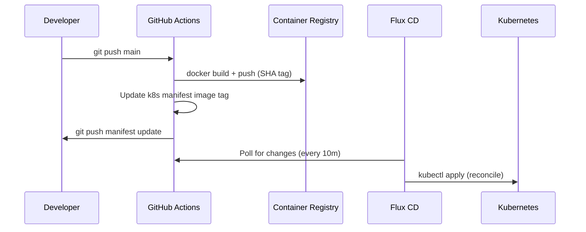

**Status:** Accepted
**Date:** 2024-11-15

## Context

The platform hosts multiple sites, each deployed as a Docker container in Kubernetes. A deployment workflow is needed that:

- Automatically deploys when code is pushed to `main`
- Keeps the cluster state in sync with the Git repository
- Supports multiple sites without duplicating CI logic
- Provides a clear audit trail of what is deployed and when

Options considered:

1. Direct `kubectl apply` from CI pipelines
2. Helm with a CI-driven upgrade step
3. Flux CD (GitOps operator)
4. ArgoCD

## Decision

Use **Flux CD** as the GitOps operator, with GitHub Actions CI for building and pushing Docker images.

The workflow is:

1. Developer pushes code to `main`
2. GitHub Actions builds the Docker image and pushes to GHCR and ACR
3. CI updates the `image:` tag in `k8s/<site>/deployment.yaml` and commits back to `main`
4. Flux CD detects the manifest change and reconciles the cluster

Each site has its own `Kustomization` CR in `k8s/flux-system/<site>-sync.yaml`, pointing to `./k8s/<site>/`.

## Consequences

**Positive:**

- Git is the single source of truth for cluster state
- Pull-based model: cluster pulls from Git, not CI pushing to cluster
- Flux reconciles drift automatically — manual `kubectl` changes are reverted
- Each site is independently managed via its own `Kustomization`
- Clear audit trail: every deploy is a Git commit

**Negative:**

- Flux must be bootstrapped and maintained in the cluster
- CI needs write access to the repository to commit manifest updates
- The `--frozen-lockfile` / commit-back pattern creates "bot commits" on `main`

**Neutral:**

- Flux polls every 10 minutes by default; push-based notification can speed this up
- All Kubernetes manifests are plain YAML (no Helm templating) — simpler but less reusable
