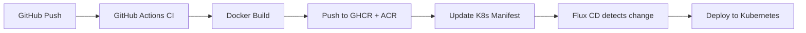

Welcome to the platform documentation. This repository is a monorepo hosting multiple sites for Kevin Ryan (DevOps & AI Governance Consultant).

## Sites

| Site | URL | Stack |
|------|-----|-------|
| Portfolio | [kevinryan.io](https://kevinryan.io) | Next.js 16, React 19, TypeScript, Tailwind CSS |
| Brand Guidelines | [brand.kevinryan.io](https://brand.kevinryan.io) | Static HTML |
| Docs | [docs.kevinryan.io](https://docs.kevinryan.io) | Astro Starlight |
| AI Immigrants | [aiimmigrants.com](https://aiimmigrants.com) | Static HTML |

## Infrastructure

All sites are deployed to Kubernetes via Flux CD (GitOps). Docker images are built in CI and pushed to GitHub Container Registry (GHCR) and Azure Container Registry (ACR).

## Architecture Decisions

See the [Architecture Decisions](/adr/) section for records of key technical choices made in this platform.
